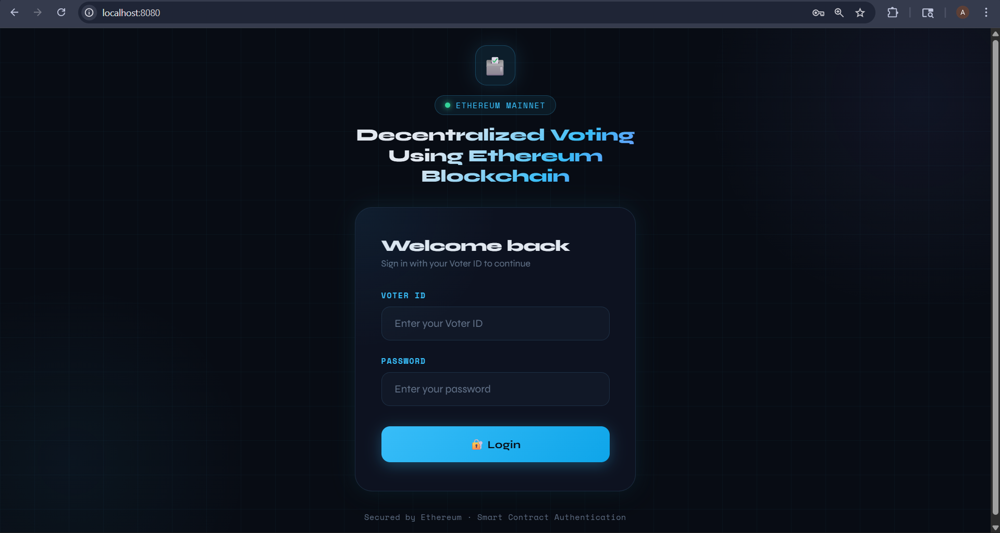
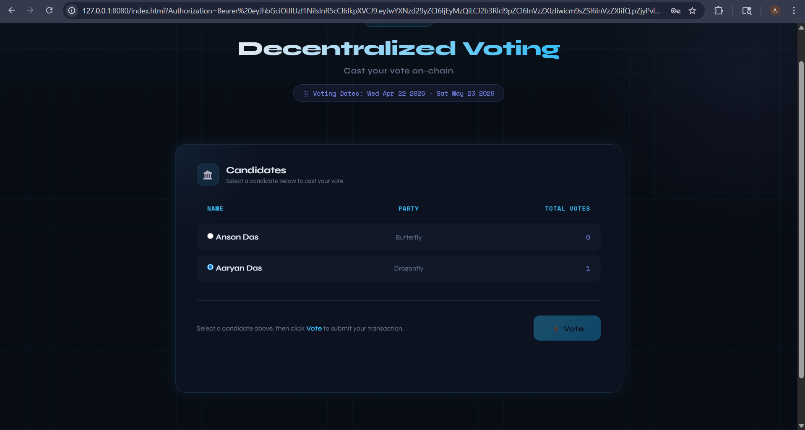
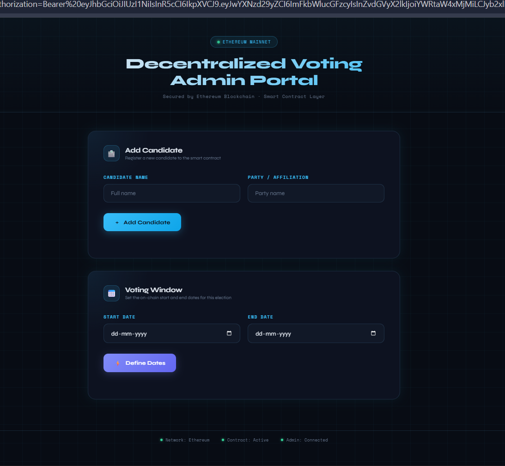

# 🗳️ Decentralized Voting System Using Ethereum Blockchain


> A secure, transparent, and tamper-proof online voting application built on the Ethereum blockchain. Votes are recorded as immutable on-chain transactions — no intermediaries, no manipulation.

---

## 📸 Screenshots

| Login Page | Voting Page | Admin Panel |
|-----------|------------|-------------|
|  |  |  |

---

## 📖 Wiki

Full project documentation is available in the [GitHub Wiki](../../wiki):

| Page | Description |
|------|-------------|
| [Home](../../wiki/Home) | Project overview, team, and objectives |
| [Introduction](../../wiki/Introduction) | Background, motivation, and existing vs proposed system |
| [System Architecture](../../wiki/System-Architecture) | Architecture diagram and component breakdown |
| [Technologies Used](../../wiki/Technologies-Used) | Full tech stack details |
| [Implementation](../../wiki/Implementation) | Setup guide and code walkthrough |
| [Results](../../wiki/Results) | Test cases and output screenshots |
| [Future Scope](../../wiki/Future-Scope) | Planned enhancements |

---

## ✨ Features

- 🔐 **JWT Authentication** — Secure role-based login for voters and admins
- 🧾 **Smart Contract Voting** — Votes recorded immutably on Ethereum via Solidity
- 👤 **Two-Role System** — Separate dashboards for Voters and Administrators
- 📅 **Admin-Controlled Election Window** — Set start/end dates on the blockchain
- 📊 **Real-Time Vote Count** — Live tallies updated as transactions confirm
- 🌍 **Vote from Anywhere** — No physical presence required
- 🔒 **One Voter, One Vote** — Enforced at the smart contract level

---

## 🛠️ Tech Stack

| Layer | Technology |
|-------|-----------|
| Smart Contract | Solidity 0.5.16, Truffle 5.7.6 |
| Local Blockchain | Ganache 7.7.3 |
| Wallet | MetaMask |
| Frontend | JavaScript (ES6), Web3.js 1.8.2 |
| Backend | Python 3.9, FastAPI |
| Database | MySQL (port 3306) |
| Auth | JWT (PyJWT) |
| Runtime | Node.js 18.14.0 |

---

## 🚀 Getting Started

### Prerequisites

- [Node.js v18.14.0](https://nodejs.org/)
- [Python 3.9](https://www.python.org/)
- [Ganache v7.7.3](https://trufflesuite.com/ganache/)
- [Truffle v5.7.6](https://trufflesuite.com/) — `npm install -g truffle`
- [MetaMask](https://metamask.io/) browser extension
- [MySQL Server](https://dev.mysql.com/downloads/)

### Installation

**1. Clone the repository**
```bash
git clone https://github.com/aaryansah7/E-Voting-System-using-Blockchain-Ganache-MetaMask-.git
cd E-Voting-System-using-Blockchain-Ganache-MetaMask-
```

**2. Install Node.js dependencies**
```bash
npm install
```

**3. Install Python dependencies**
```bash
pip install fastapi uvicorn mysql-connector-python python-dotenv PyJWT
```

**4. Configure environment variables**

Create a `.env` file in the root directory:
```env
DB_HOST=localhost
DB_USER=root
DB_PASSWORD=your_password
DB_NAME=database_name
SECRET_KEY=your_secret_key
```

**5. Set up the MySQL database**
```sql
CREATE DATABASE voting_db;
USE voting_db;

CREATE TABLE voters (
    voter_id VARCHAR(50) PRIMARY KEY,
    password VARCHAR(255) NOT NULL,
    role ENUM('admin', 'user') NOT NULL
);

INSERT INTO voters VALUES ('admin01', 'adminpass', 'admin');
INSERT INTO voters VALUES ('voter01', 'voterpass', 'user');
```

**6. Start Ganache** and create a workspace on port `7545`.

**7. Compile and deploy the smart contract**
```bash
truffle compile
truffle migrate --reset
```

**8. Start the FastAPI backend**
```bash
uvicorn main:app --reload --port 8000
```

**9. Start the frontend**
```bash
node server.js
```

**10. Open the app**

Navigate to `http://127.0.0.1:8080` in your browser with MetaMask connected to the Ganache network (`http://127.0.0.1:7545`).

---

## 📁 Project Structure

```
decentralized-voting/
│
├── contracts/                  # Solidity smart contracts
│   ├── Migrations.sol
│   └── Voting.sol
│
├── migrations/                 # Truffle migration scripts
│
├── build/contracts/            # Compiled ABIs (auto-generated)
│   └── Voting.json
│
├── src/                        # Frontend
│   ├── login.html
│   ├── index.html              # Voter dashboard
│   ├── admin.html              # Admin dashboard
│   └── js/
│       ├── App.js              # Web3 + contract interaction
│       └── login.js            # Auth + redirect logic
│
├── main.py                     # FastAPI backend
├── .env                        # Environment variables (not committed)
├── package.json
└── truffle-config.js
```

---

## 🧪 Test Results

All 5 test cases passed:

| # | Test | Type | Result |
|---|------|------|--------|
| 1 | JWT Authorization | Unit | ✅ Pass |
| 2 | User Login | Functional | ✅ Pass |
| 3 | Candidate Registration | Unit | ✅ Pass |
| 4 | Voting Date Setup | Unit | ✅ Pass |
| 5 | Vote Casting | Functional | ✅ Pass |

---

## 🔮 Future Enhancements

- Biometric voter authentication
- AI-powered voter analytics
- Layer 2 deployment (Polygon / Optimism) for scalability
- Zero-Knowledge Proofs for voter privacy
- Mobile application via React Native

---

## 👥 Team

| Name | App ID |
|------|---------|
| Aaryan Sah | 2306528 |
| Agniv Banerjee | 2304952 |
| Aum Tripathi | 2390080 |


---

## 📄 License

This project is licensed under the MIT License — see the [LICENSE](LICENSE) file for details.

---

## 🙏 Acknowledgements

- [Ethereum Foundation](https://ethereum.org/) for blockchain infrastructure documentation
- [Truffle Suite](https://trufflesuite.com/) for smart contract development tools
